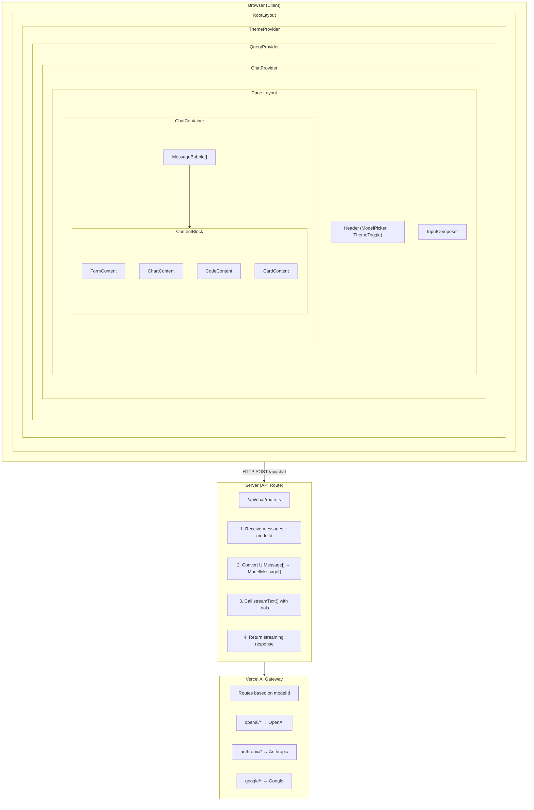
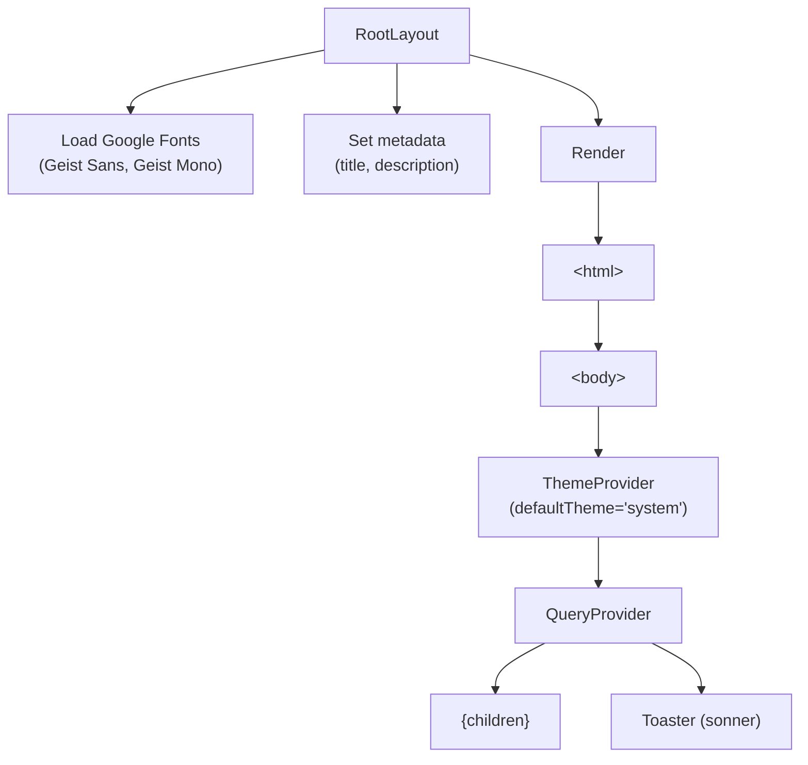
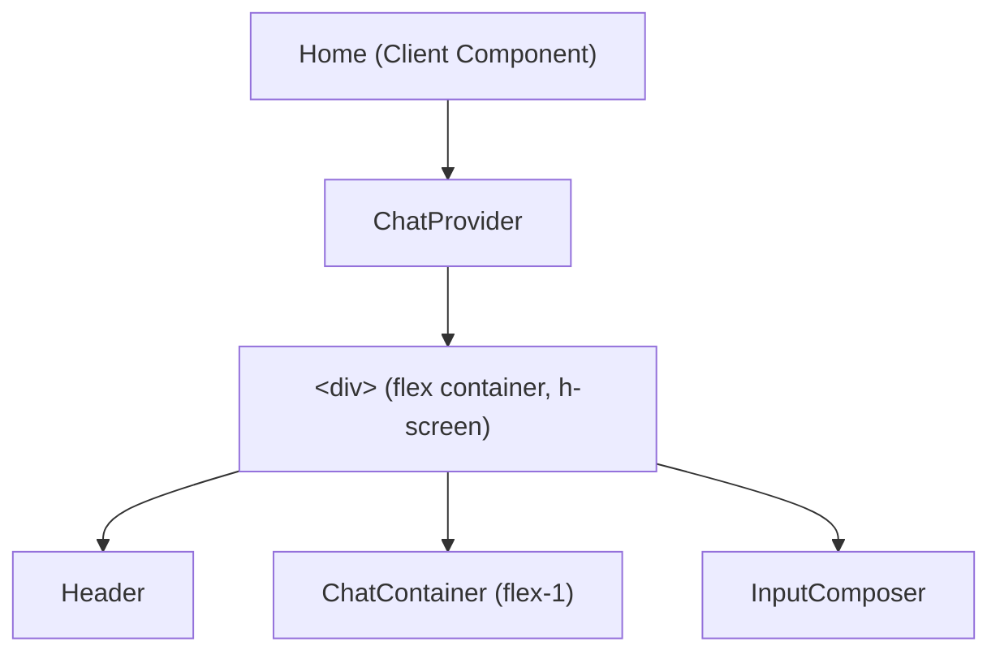
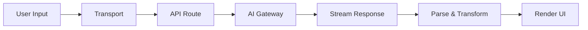
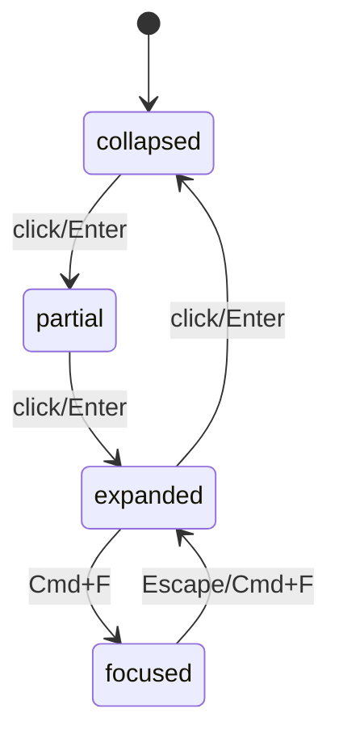
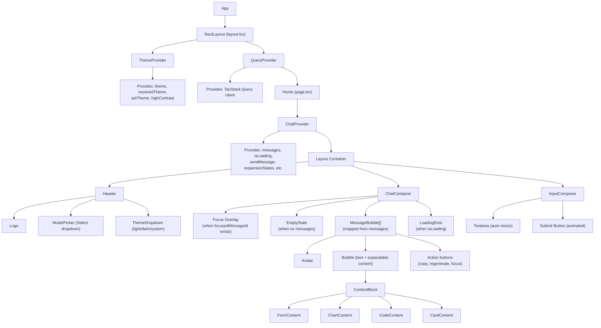
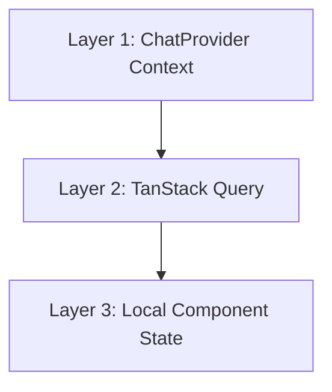
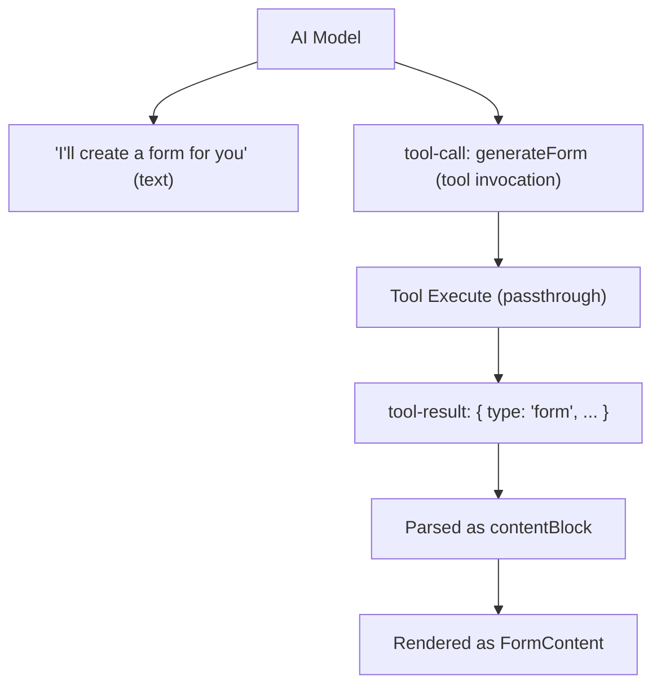
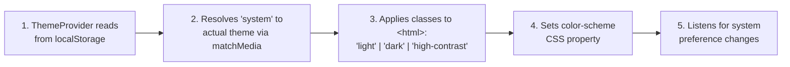

# Sequenzia AI - Application Flow

This document provides a comprehensive overview of how the Sequenzia AI application works, from user input to rendered output.

## Table of Contents

1. [Overview](#overview)
2. [Architecture Diagram](#architecture-diagram)
3. [Application Startup Flow](#application-startup-flow)
4. [Message Flow](#message-flow)
5. [Expansion System](#expansion-system)
6. [Component Hierarchy](#component-hierarchy)
7. [State Management](#state-management)
8. [API Integration](#api-integration)
9. [Theming System](#theming-system)
10. [Key Files Reference](#key-files-reference)

---

## Overview

Sequenzia AI is a Next.js chat application implementing the **Expanding Message Paradigm** - messages can expand in-place to reveal interactive content (forms, charts, code, cards) rather than opening in separate panels.

### Core Technologies

- **Framework**: Next.js 15 (App Router)
- **AI Integration**: Vercel AI SDK v6 (`ai`, `@ai-sdk/react`)
- **AI Gateway**: Vercel AI Gateway for multi-provider model support
- **State Management**: React Context + useReducer
- **Server State**: TanStack Query
- **Animations**: Framer Motion
- **Styling**: Tailwind CSS + shadcn/ui
- **Validation**: Zod schemas

---

## Architecture Diagram



---

## Application Startup Flow

### 1. Server-Side Rendering (layout.tsx)



### 2. Client-Side Hydration (page.tsx)



### 3. Provider Initialization

1. **ThemeProvider**: Reads theme from localStorage, applies to document
2. **QueryProvider**: Creates TanStack Query client with default options
3. **ChatProvider**:
   - Initializes `useAIChat` hook with `DefaultChatTransport`
   - Creates expansion state reducer (empty Map)
   - Sets default model ID

---

## Message Flow

For comprehensive documentation on message flow, tool calling, and the AI SDK integration, see **[Message Flow Architecture](./message-flow.md)**.

### Quick Overview



| Stage | Key Component | Purpose |
|-------|---------------|---------|
| Input | InputComposer | Capture user message |
| Transport | DefaultChatTransport | POST to /api/chat |
| API | /api/chat/route.ts | Process + call AI with tools |
| Gateway | Vercel AI Gateway | Route to AI provider |
| Stream | useAIChat | Receive SSE chunks |
| Parse | ChatProvider | Transform to Message[] |
| Render | MessageBubble | Display with animations |

### Tool Calling

The API provides four tools for generating interactive content:

| Tool | Output | Use Case |
|------|--------|----------|
| `generateForm` | Interactive form | Data collection, settings |
| `generateChart` | Data visualization | Trends, comparisons |
| `generateCode` | Code block | Code snippets with syntax highlighting |
| `generateCard` | Rich content card | Articles, products, profiles |

See [Message Flow Architecture](./message-flow.md) for detailed tool schemas, execution flow, and the complete message transformation pipeline.

---

## Expansion System

### 4-State Model

Messages with content blocks exist in one of four states:

| State | Description |
|-------|-------------|
| **collapsed** | Icon + title only |
| **partial** | Preview (limited content) |
| **expanded** | Full content |
| **focused** | Full + backdrop blur + scale 1.02 + ring highlight |

**Content Display by State:**

| Content Type | collapsed | partial | expanded | focused |
|--------------|-----------|---------|----------|---------|
| **Form** | badge | 3 fields | All fields | All + submit enabled |
| **Chart** | icon | 150px | 300px | 300px + legend |
| **Code** | lang | 10 lines | All lines | All + stats |
| **Card** | title | Truncated | Full + media | Full + actions |

### State Transitions



### Expansion State Management

```typescript
// State stored in Map<messageId, ExpansionStateData>
interface ExpansionStateData {
  messageId: string;
  state: 'collapsed' | 'partial' | 'expanded' | 'focused';
  pinned: boolean;        // Prevents collapse during collapseAll
  interactionDepth: number; // Tracks user interactions
}

// Reducer actions
type ExpansionAction =
  | { type: 'SET_STATE'; messageId: string; state: ExpansionState }
  | { type: 'TOGGLE'; messageId: string }     // Cycles: collapsed→partial→expanded→collapsed
  | { type: 'FOCUS'; messageId: string }      // Sets focused + pinned
  | { type: 'UNFOCUS'; messageId: string }    // Returns to expanded
  | { type: 'PIN'; messageId: string; pinned: boolean }
  | { type: 'COLLAPSE_ALL'; except?: string };
```

### Keyboard Navigation (useExpansion hook)

| Key        | Action                                      |
|------------|---------------------------------------------|
| `Enter`    | Toggle expansion state                      |
| `Space`    | Toggle expansion state                      |
| `Escape`   | If focused → unfocus; else → collapse       |
| `Cmd+F`    | Toggle focus mode                           |

### Double-Tap Detection

```typescript
// 300ms threshold for double-tap
if (timeSinceLastClick < 300) {
  // Double tap → jump between collapsed and expanded
} else {
  // Single tap → normal toggle through states
}
```

---

## Component Hierarchy

### Full Component Tree



### Component Responsibilities

| Component | Responsibility |
|-----------|----------------|
| `ChatProvider` | Global chat state, AI connection, expansion management |
| `ChatContainer` | Scroll management, focus overlay, message list |
| `MessageBubble` | Individual message rendering, expansion UI, animations |
| `ContentBlock` | Routes to correct content component based on type |
| `FormContent` | Interactive form with field rendering, submission |
| `ChartContent` | Recharts-based visualization (line/bar/pie/area) |
| `CodeContent` | Syntax highlighted code block with copy |
| `CardContent` | Rich content card with optional media/actions |
| `InputComposer` | Message input, auto-resize, keyboard handling |
| `Header` | Model picker, theme toggle, branding |

---

## State Management

### Three Layers of State



**Layer 1: ChatProvider Context (Global Chat State)**

| Category | Properties |
|----------|------------|
| **State** | `messages`, `isLoading`, `error`, `expansionStates`, `modelId`, `focusedMessageId` |
| **Actions** | `sendMessage()`, `regenerateLastMessage()`, `clearMessages()`, `stop()`, `setModelId()`, `toggleExpansion()`, `focusMessage()`, `unfocusMessage()`, `pinMessage()`, `collapseAll()` |

**Layer 2: TanStack Query (Server State)**

| Setting | Value |
|---------|-------|
| staleTime | 60s |
| gcTime | 5min |
| refetchOnWindowFocus | false |
| retry | 1 |

*Currently minimal usage - prepared for future API caching.*

**Layer 3: Local Component State**

| Component | State |
|-----------|-------|
| InputComposer | `message: string` |
| FormContent | `formData: Record<string, value>`, `submitted: boolean` |
| CodeContent | `copied: boolean` |
| ThemeProvider | `theme`, `resolvedTheme`, `highContrast` |

---

## API Integration

### API Route: `/api/chat/route.ts`

```typescript
// Request
POST /api/chat
{
  messages: UIMessage[],  // From DefaultChatTransport
  modelId: string         // e.g., "openai/gpt-4o"
}

// Processing
1. Validate modelId against MODELS list
2. Convert UIMessage[] → ModelMessage[]
   - Extract text from parts
   - Convert tool parts to tool-call/tool-result format
3. Call streamText() with Vercel AI Gateway

// Response
StreamingTextResponse (SSE)
```

### Available AI Tools

| Tool | Description | Output Schema |
|------|-------------|---------------|
| `generateForm` | Creates interactive forms | `FormContentData` |
| `generateChart` | Creates data visualizations | `ChartContentData` |
| `generateCode` | Creates code blocks | `CodeContentData` |
| `generateCard` | Creates rich content cards | `CardContentData` |

### Tool Execution Flow



---

## Theming System

### CSS Custom Properties

```css
/* Base tokens (shadcn/ui) */
--background, --foreground, --primary, --secondary,
--muted, --accent, --destructive, --border, --ring

/* Message-specific */
--message-user          /* User message background */
--message-assistant     /* Assistant message background */
--message-focused       /* Focused state ring color */

/* Content-specific */
--form-field           /* Form input backgrounds */
--chart-grid           /* Chart gridlines */
--chart-axis           /* Chart axis labels */
--code-background      /* Code block background */
--code-line-number     /* Line number color */

/* Chart colors */
--chart-1 through --chart-5
```

### Theme Switching



---

## Key Files Reference

### Core Application

| File | Purpose |
|------|---------|
| `src/app/layout.tsx` | Root layout with providers |
| `src/app/page.tsx` | Main page with ChatProvider |
| `src/app/api/chat/route.ts` | AI chat API endpoint |

### Components

| File | Purpose |
|------|---------|
| `src/components/chat/ChatProvider.tsx` | Global state + AI integration |
| `src/components/chat/ChatContainer.tsx` | Message list + scroll management |
| `src/components/chat/MessageBubble.tsx` | Individual message rendering |
| `src/components/chat/InputComposer.tsx` | Message input |
| `src/components/blocks/ContentBlock.tsx` | Content type router |
| `src/components/blocks/FormContent.tsx` | Interactive forms |
| `src/components/blocks/ChartContent.tsx` | Data visualizations |
| `src/components/blocks/CodeContent.tsx` | Code blocks |
| `src/components/blocks/CardContent.tsx` | Rich content cards |
| `src/components/Header.tsx` | App header with model picker |
| `src/components/ModelPicker.tsx` | Model selection dropdown |

### Providers

| File | Purpose |
|------|---------|
| `src/components/providers/ThemeProvider.tsx` | Theme state + system preference |
| `src/components/providers/QueryProvider.tsx` | TanStack Query setup |

### Hooks

| File | Purpose |
|------|---------|
| `src/hooks/useExpansion.ts` | Expansion state + keyboard nav |
| `src/hooks/useScrollAnchor.ts` | Scroll position management |

### Types

| File | Purpose |
|------|---------|
| `src/types/message.ts` | Message, content block, tool schemas |
| `src/types/conversation.ts` | Conversation types |
| `src/types/theme.ts` | Theme type definitions |

### Utilities

| File | Purpose |
|------|---------|
| `src/lib/utils.ts` | cn() helper for classnames |
| `src/lib/models.ts` | Model definitions + validation |

---

## Animation Timings

| Animation | Duration | Easing |
|-----------|----------|--------|
| Expand content | 250ms | easeOut |
| Collapse content | 200ms | default |
| Focus scale | 250ms | easeOut |
| Loading dots | bounce | staggered 150ms |
| Submit button | 200ms | default |
| Form field enter | 50ms stagger | default |

---

## Environment Variables

| Variable | Purpose |
|----------|---------|
| `AI_GATEWAY_API_KEY` | Vercel AI Gateway authentication |

---

## Future Considerations

1. **Conversation persistence**: Currently in-memory only
2. **File attachments**: Types defined but not implemented
3. **Real-time collaboration**: Not implemented
4. **Message editing**: Not implemented
5. **Tool result caching**: TanStack Query configured but minimal usage

---

## Related Documentation

| Document | Description |
|----------|-------------|
| [Message Flow Architecture](./message-flow.md) | Deep-dive into message flow, tool calling, AI SDK integration, and the complete request lifecycle |
