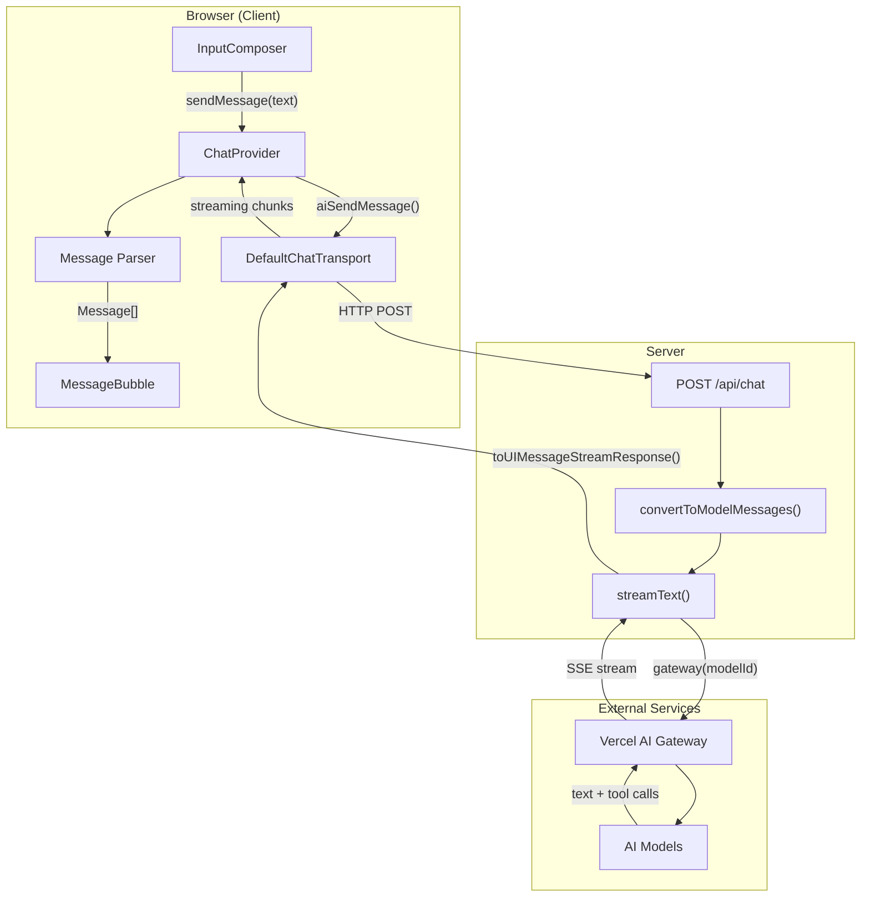
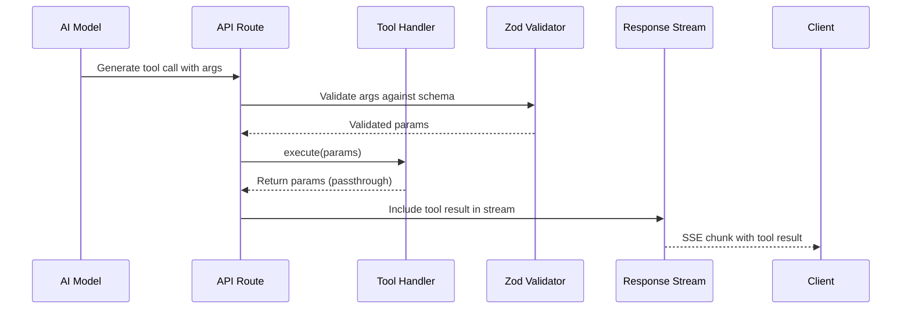
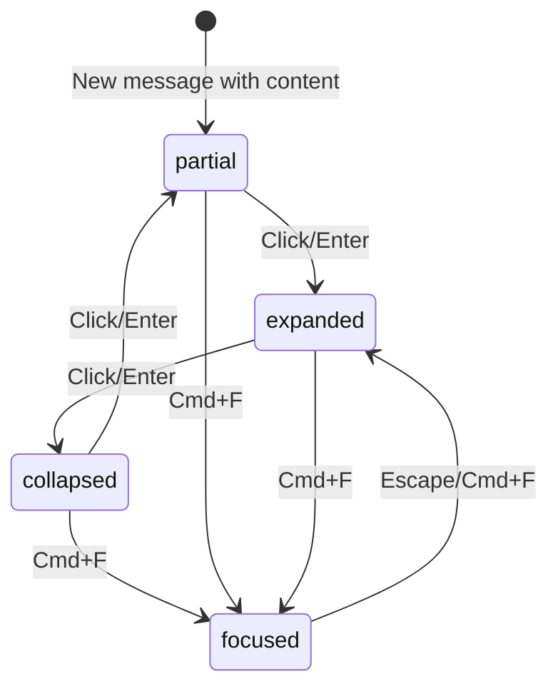

# Message Flow Architecture

This document provides a comprehensive deep-dive into how messages flow through the Sequenzia AI application, from user input to rendered output, with particular focus on tool calling and the AI SDK integration.

## Table of Contents

1. [Overview](#overview)
2. [High-Level Flow Diagram](#high-level-flow-diagram)
3. [User Input Stage](#user-input-stage)
4. [Client Transport Layer](#client-transport-layer)
5. [API Route Processing](#api-route-processing)
6. [Tool Calling System](#tool-calling-system)
7. [Response Streaming](#response-streaming)
8. [Message Transformation Pipeline](#message-transformation-pipeline)
9. [Content Block Parsing](#content-block-parsing)
10. [Auto-Expansion System](#auto-expansion-system)
11. [Rendering Pipeline](#rendering-pipeline)
12. [Error Handling](#error-handling)
13. [Key Files Reference](#key-files-reference)

---

## Overview

The message flow in Sequenzia AI follows a unidirectional data flow pattern:

```
User Input → Transport → API → AI Model → Tool Execution → Stream Response → Parse → Render
```

Key technologies involved:
- **Vercel AI SDK v6** (`ai`, `@ai-sdk/react`) for chat management and streaming
- **Vercel AI Gateway** for multi-provider model routing
- **Zod** for tool schema validation
- **React Context + useReducer** for state management

---

## High-Level Flow Diagram



---

## User Input Stage

### InputComposer Component

**Location:** `src/components/chat/InputComposer.tsx`

The user input journey begins in the InputComposer component:

```typescript
// User types message in textarea
// On Enter (without Shift), handleSubmit is triggered

const handleSubmit = useCallback(
  (e?: React.FormEvent) => {
    e?.preventDefault()
    const trimmedMessage = message.trim()
    if (!trimmedMessage || isLoading) return

    sendMessage(trimmedMessage)  // From ChatProvider context
    setMessage('')               // Clear input
  },
  [message, isLoading, sendMessage]
)
```

**Key behaviors:**
- `Enter` sends the message
- `Shift+Enter` creates a newline
- Empty messages are ignored
- Input is disabled while `isLoading` is true

---

## Client Transport Layer

### ChatProvider Setup

**Location:** `src/components/chat/ChatProvider.tsx`

The ChatProvider initializes the AI SDK transport:

```typescript
const transport = useMemo(
  () => new DefaultChatTransport({ api: '/api/chat' }),
  []
)

const {
  messages: aiMessages,
  error,
  status,
  sendMessage: aiSendMessage,
  stop,
  setMessages,
} = useAIChat({ transport })
```

### Send Message Flow

When `sendMessage()` is called from context:

```typescript
const sendMessage = useCallback(
  async (content: string) => {
    await aiSendMessage({
      content,
      body: { modelId },  // Include selected model in request
    })
  },
  [aiSendMessage, modelId]
)
```

**Request payload structure:**
```typescript
{
  messages: UIMessage[],  // Full conversation history
  modelId: string         // e.g., "openai/gpt-4o"
}
```

---

## API Route Processing

### Request Handler

**Location:** `src/app/api/chat/route.ts`

The API route receives the request and processes it:

```typescript
export async function POST(req: Request) {
  const { messages: uiMessages, modelId } = await req.json()

  // 1. Validate model selection
  const selectedModelId = MODELS.some((m) => m.id === modelId)
    ? modelId
    : DEFAULT_MODEL_ID

  // 2. Convert UI messages to model format
  const modelMessages = convertToModelMessages(uiMessages)

  // 3. Call AI with tools
  const result = streamText({
    model: gateway(selectedModelId),
    system: SYSTEM_PROMPT,
    messages: modelMessages,
    tools: { generateForm, generateChart, generateCode, generateCard },
    maxSteps: 5,
  })

  // 4. Return streaming response
  return result.toUIMessageStreamResponse()
}
```

### Message Conversion

The `convertToModelMessages()` function transforms AI SDK UIMessage format to the model's expected format:

```typescript
function convertToModelMessages(uiMessages: UIMessage[]): ModelMessage[] {
  const modelMessages: ModelMessage[] = []

  for (const msg of uiMessages) {
    // Extract text content from parts
    const textContent = msg.parts
      ?.filter((p): p is TextPart => p.type === 'text')
      .map((p) => p.text)
      .join('\n') || ''

    // Extract tool invocations
    const toolParts = msg.parts?.filter((p) =>
      p.type.startsWith('tool-')
    ) || []

    if (msg.role === 'user') {
      modelMessages.push({ role: 'user', content: textContent })
    } else if (msg.role === 'assistant') {
      // Handle assistant messages with potential tool calls
      // ... (detailed conversion logic)
    }
  }

  return modelMessages
}
```

**Conversion handles:**
- Text extraction from message parts
- Tool call reconstruction
- Tool result pairing
- Message role mapping

---

## Tool Calling System

### Overview

Sequenzia AI uses four tools to generate interactive content:

| Tool | Purpose | Output Type |
|------|---------|-------------|
| `generateForm` | Create interactive forms | `FormContentData` |
| `generateChart` | Create data visualizations | `ChartContentData` |
| `generateCode` | Create code blocks | `CodeContentData` |
| `generateCard` | Create rich content cards | `CardContentData` |

### Tool Definition Pattern

All tools follow an identical pattern - they accept validated input and return it as-is:

```typescript
const generateForm = tool({
  description: 'Generate an interactive form...',
  parameters: FormContentDataSchema,
  execute: async (params) => params,  // Identity function
})
```

This "passthrough" design means:
1. The AI model generates the structured data
2. Zod validates it against the schema
3. The validated data becomes the tool result
4. No server-side processing is needed

### Tool Schemas

#### FormContentData Schema

```typescript
const FormFieldSchema = z.object({
  id: z.string(),
  type: z.enum([
    'text', 'textarea', 'select', 'checkbox',
    'radio', 'date', 'slider', 'file', 'number', 'email'
  ]),
  label: z.string(),
  placeholder: z.string().optional(),
  required: z.boolean().optional(),
  defaultValue: z.union([z.string(), z.number(), z.boolean()]).optional(),
  options: z.array(z.object({
    label: z.string(),
    value: z.string(),
  })).optional(),
  min: z.number().optional(),
  max: z.number().optional(),
  step: z.number().optional(),
})

const FormContentDataSchema = z.object({
  type: z.literal('form'),
  title: z.string(),
  description: z.string().optional(),
  fields: z.array(FormFieldSchema),
  submitLabel: z.string().optional(),
})
```

#### ChartContentData Schema

```typescript
const ChartContentDataSchema = z.object({
  type: z.literal('chart'),
  chartType: z.enum(['line', 'bar', 'pie', 'area']),
  title: z.string(),
  description: z.string().optional(),
  data: z.array(z.record(z.unknown())),  // Flexible data structure
  xKey: z.string(),
  yKey: z.string(),
  config: z.record(z.object({
    label: z.string().optional(),
    color: z.string().optional(),
  })).optional(),
})
```

#### CodeContentData Schema

```typescript
const CodeContentDataSchema = z.object({
  type: z.literal('code'),
  language: z.string(),
  filename: z.string().optional(),
  code: z.string(),
  editable: z.boolean().optional(),
  showLineNumbers: z.boolean().optional(),
})
```

#### CardContentData Schema

```typescript
const CardContentDataSchema = z.object({
  type: z.literal('card'),
  title: z.string(),
  description: z.string().optional(),
  content: z.string(),
  media: z.object({
    type: z.enum(['image', 'video']),
    url: z.string(),
    alt: z.string().optional(),
  }).optional(),
  actions: z.array(z.object({
    label: z.string(),
    action: z.string(),
    variant: z.enum(['default', 'outline', 'ghost']).optional(),
  })).optional(),
})
```

### Tool Execution Flow



### System Prompt

The system prompt instructs the AI when to use tools:

```typescript
const SYSTEM_PROMPT = `You are a helpful AI assistant with access to tools
for generating interactive content. When appropriate, use:

- generateForm: For collecting user input (surveys, settings, data entry)
- generateChart: For visualizing data (trends, comparisons, distributions)
- generateCode: For sharing code snippets with syntax highlighting
- generateCard: For rich content display (articles, products, profiles)

Always provide context before using a tool. Explain what you're creating
and why it's helpful.`
```

---

## Response Streaming

### Stream Processing

The AI SDK handles streaming via Server-Sent Events (SSE):

```typescript
const result = streamText({
  model: gateway(selectedModelId),
  // ... configuration
})

return result.toUIMessageStreamResponse()
```

**Stream chunk types:**
- `text-delta`: Incremental text content
- `tool-call`: Tool invocation with arguments
- `tool-result`: Tool execution result
- `finish`: Stream completion signal

### Client-Side Reception

The `useAIChat` hook automatically processes the stream:

```typescript
const {
  messages: aiMessages,  // Updated as stream arrives
  status,                // 'idle' | 'submitted' | 'streaming'
  error,                 // Any errors during streaming
} = useAIChat({ transport })
```

**Status transitions:**
```
idle → submitted → streaming → idle
                 ↘ error → idle
```

---

## Message Transformation Pipeline

### Raw to Internal Format

The ChatProvider transforms AI SDK messages to the internal `Message` type:

```typescript
const messages: Message[] = useMemo(() => {
  return aiMessages.map((msg) => {
    // 1. Extract text content
    const textParts = msg.parts?.filter(
      (p): p is TextPart => p.type === 'text'
    ) || []
    const content = textParts.map((p) => p.text).join('\n')

    // 2. Extract tool invocations
    const toolParts = msg.parts?.filter((p) =>
      p.type.startsWith('tool-')
    ) || []

    const toolInvocations: ToolInvocation[] = toolParts.map((part) => {
      const toolName = part.type.replace('tool-', '')
      return {
        id: part.toolCallId,
        toolName,
        args: part.input,
        state: part.state === 'output-available' ? 'result' : 'pending',
        result: part.output,
      }
    })

    // 3. Parse content block from tool results
    const contentBlock = parseContentBlock(toolInvocations)

    // 4. Return transformed message
    return {
      id: msg.id,
      role: msg.role as 'user' | 'assistant',
      content,
      timestamp: new Date().toISOString(),
      contentBlock,
      toolInvocations: toolInvocations.length > 0 ? toolInvocations : undefined,
    }
  })
}, [aiMessages])
```

### Message Type Definition

```typescript
interface Message {
  id: string
  role: 'user' | 'assistant'
  content: string              // Text content only
  timestamp: string
  attachments?: Attachment[]
  contentBlock?: ContentBlock  // Parsed tool result
  toolInvocations?: ToolInvocation[]     // All tool calls with state
}
```

### Tool Invocation States

```typescript
interface ToolInvocation {
  id: string
  toolName: string
  args: unknown
  state: 'pending' | 'result' | 'error'
  result?: unknown
}
```

**State meanings:**
- `pending`: Tool call made, awaiting result
- `result`: Tool executed successfully, result available
- `error`: Tool execution failed

---

## Content Block Parsing

### Parser Function

```typescript
function parseContentBlock(
  toolInvocations?: ToolInvocation[]
): ContentBlock | undefined {
  if (!toolInvocations?.length) return undefined

  // Find first completed tool invocation
  for (const tool of toolInvocations) {
    if (tool.state === 'result' && tool.result) {
      const result = tool.result as { type?: string }

      // Validate type matches expected content types
      if (['form', 'chart', 'code', 'card'].includes(result.type || '')) {
        return result as ContentBlock
      }
    }
  }

  return undefined
}
```

### Content Type Union

```typescript
type ContentBlock =
  | FormContentData
  | ChartContentData
  | CodeContentData
  | CardContentData
```

Each type is discriminated by the `type` field:
- `{ type: 'form', ... }` → FormContentData
- `{ type: 'chart', ... }` → ChartContentData
- `{ type: 'code', ... }` → CodeContentData
- `{ type: 'card', ... }` → CardContentData

---

## Auto-Expansion System

### Automatic State Initialization

When a new assistant message arrives with a content block, it automatically expands to 'partial' state:

```typescript
useEffect(() => {
  const lastMessage = messages[messages.length - 1]

  if (
    lastMessage?.role === 'assistant' &&
    lastMessage?.contentBlock &&
    !expansionStates.has(lastMessage.id)
  ) {
    dispatchExpansion({
      type: 'SET_STATE',
      messageId: lastMessage.id,
      state: 'partial',
    })
  }
}, [messages, expansionStates, dispatchExpansion])
```

### Expansion State Management

```typescript
type ExpansionState = 'collapsed' | 'partial' | 'expanded' | 'focused'

interface ExpansionStateData {
  messageId: string
  state: ExpansionState
  pinned: boolean           // Prevents collapse during collapseAll
  interactionDepth: number  // Tracks user interactions
}

// State stored as Map<messageId, ExpansionStateData>
```

### State Transitions



---

## Rendering Pipeline

### MessageBubble Component

**Location:** `src/components/chat/MessageBubble.tsx`

The MessageBubble component renders based on expansion state:

```typescript
function MessageBubble({ message }: Props) {
  const { expansionStates, toggleExpansion } = useChat()
  const expansionData = expansionStates.get(message.id)
  const expansionState = expansionData?.state || 'collapsed'

  const hasContentBlock = !!message.contentBlock

  return (
    <motion.div
      className={cn(
        'message-bubble',
        expansionState === 'focused' && 'z-20 scale-102'
      )}
    >
      {/* Text content */}
      <p>{message.content}</p>

      {/* Content block with animation */}
      <AnimatePresence>
        {hasContentBlock && expansionState !== 'collapsed' && (
          <motion.div
            initial={{ height: 0, opacity: 0 }}
            animate={{ height: 'auto', opacity: 1 }}
            exit={{ height: 0, opacity: 0 }}
            transition={{ duration: 0.25 }}
          >
            <ContentBlock
              content={message.contentBlock}
              displayMode={getDisplayMode(expansionState)}
            />
          </motion.div>
        )}
      </AnimatePresence>
    </motion.div>
  )
}
```

### Display Mode Mapping

```typescript
function getDisplayMode(state: ExpansionState): DisplayMode {
  switch (state) {
    case 'collapsed': return 'preview'
    case 'partial': return 'partial'
    case 'expanded':
    case 'focused': return 'full'
  }
}
```

### Content Component Routing

**Location:** `src/components/blocks/ContentBlock.tsx`

```typescript
function ContentBlock({ content, displayMode }: Props) {
  switch (content.type) {
    case 'form':
      return <FormContent data={content} displayMode={displayMode} />
    case 'chart':
      return <ChartContent data={content} displayMode={displayMode} />
    case 'code':
      return <CodeContent data={content} displayMode={displayMode} />
    case 'card':
      return <CardContent data={content} displayMode={displayMode} />
  }
}
```

### Display Modes by Content Type

| Content | Preview | Partial | Full |
|---------|---------|---------|------|
| **Form** | Icon + badge | 3 fields (disabled) | All fields + submit |
| **Chart** | Icon only | 150px height | 300px + legend |
| **Code** | Language badge | 10 lines | All lines + stats |
| **Card** | Title only | Truncated content | Full + media + actions |

---

## Error Handling

### Current Error Points

| Location | Error Type | Handling |
|----------|------------|----------|
| API Route | Invalid model | Falls back to default model |
| API Route | Stream error | Propagates to client |
| ChatProvider | Network error | Stored in `error` state |
| Tool execution | Schema validation | Zod throws, caught by AI SDK |
| Content parsing | Type mismatch | Returns `undefined` |

### Error State Access

```typescript
const { error } = useChat()

// Error is available but not currently displayed in UI
// Future: Could show toast or inline error message
```

### Graceful Degradation

- Invalid tool results are silently ignored (no expandable content)
- Missing model falls back to default
- Stream interruptions leave partial message visible

---

## Key Files Reference

### Core Message Flow

| File | Purpose |
|------|---------|
| `src/components/chat/InputComposer.tsx` | User input handling |
| `src/components/chat/ChatProvider.tsx` | State management, message transformation |
| `src/app/api/chat/route.ts` | API endpoint, tool definitions |
| `src/types/message.ts` | Type definitions, Zod schemas |

### Content Rendering

| File | Purpose |
|------|---------|
| `src/components/chat/MessageBubble.tsx` | Message display, expansion animation |
| `src/components/blocks/ContentBlock.tsx` | Content type routing |
| `src/components/blocks/FormContent.tsx` | Interactive form rendering |
| `src/components/blocks/ChartContent.tsx` | Chart visualization |
| `src/components/blocks/CodeContent.tsx` | Code block rendering |
| `src/components/blocks/CardContent.tsx` | Rich card display |

### Configuration

| File | Purpose |
|------|---------|
| `src/lib/models.ts` | Available AI models |
| `.env.local` | `AI_GATEWAY_API_KEY` |

---

## Summary: Complete Request Lifecycle

1. **User types** message in InputComposer
2. **sendMessage()** called with text content
3. **DefaultChatTransport** sends POST to `/api/chat`
4. **API route** converts messages, calls `streamText()`
5. **Vercel AI Gateway** routes to appropriate provider
6. **AI model** generates text and/or tool calls
7. **Tool schemas** validate tool arguments via Zod
8. **Tool execute** returns validated data (passthrough)
9. **Stream response** sent back via SSE
10. **useAIChat** processes stream chunks
11. **ChatProvider** transforms to Message[] with memoization
12. **parseContentBlock()** extracts tool results
13. **Auto-expansion** sets new content to 'partial' state
14. **MessageBubble** renders with Framer Motion animations
15. **ContentBlock** routes to appropriate content component
16. **User interacts** with expansion controls or form submission
17. **Form submission** triggers new message, cycle repeats
